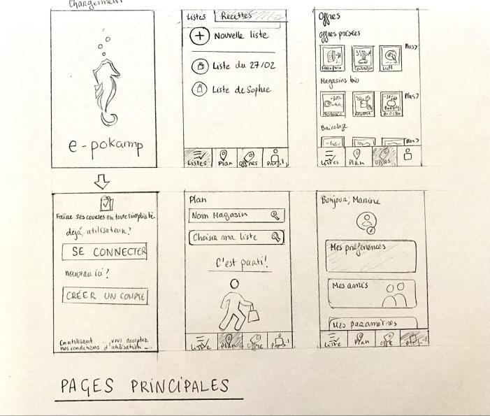
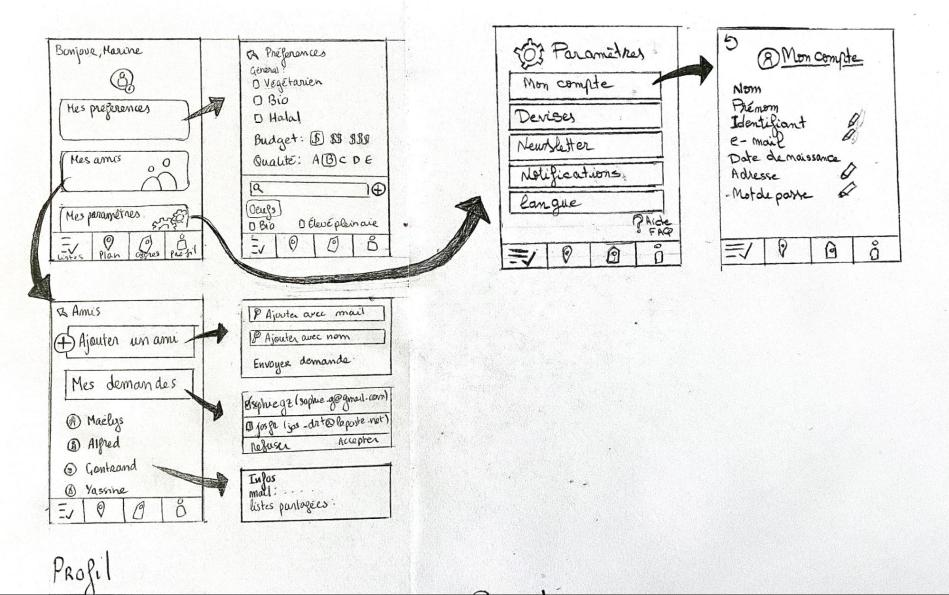
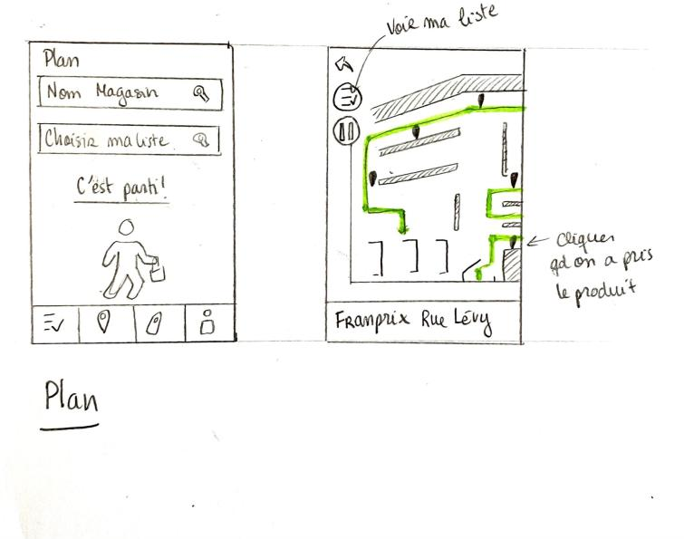

=== Interface utilisateur graphique

Il peut y avoir une ou plusieurs interfaces utilisateur (UI en anglais),
ou interface graphique, ou interface homme machine (IHM) : une interface
sur ordinateur et/ou une interface sur mobile ou tablette (Android),
selon le nombre d’appareils en jeu.

En lien avec un diagramme de séquence, une description simple de chaque
écran/page est nécessaire. Il est recommandé de faire des dessins, même
dessins au crayon photographiés ou scannés, car ce sont les meilleurs
supports de discussion : on appelle souvent ces dessins un
« storyboard ». Une description textuelle fait le lien entre tous les
éléments de l’IHM (ou des IHMs).

Notre projet est une application Android. Il est donc impératif de mettre en place une IHM pour smartphone et tablette, les dimensions étant différentes.

==== Storyboard

La première page où l'utilisateur peut intéragir est l'écran de connexion (en bas à gauche)
Cette page peut renvoyer sur une page de création de compte en cas de première connexion (avec les champs E-mail/Nom/Mot de passe/Confirmation de Mot de passe). Elle renvoie ensuite sur la page de connexion une fois les informations du compte validées.
La page de connexion demande simplement e-mail et mot de passe, et possède un bouton mot de passe oublié.
Une fois connecté, le client arrive sur la page d'acceuil (Milieu haut), dont le foctionnnement est détaillé ci dessous.
De cette page il peut accéder aux autres via les onglets.
La page offres (en haut à droite) liste les différentes promotions dans les magasins déjà utilisés par le client et les affiches par catégories 

image::../images/story_board_listes_et_recettes.jpg[Les listes et recettes]

