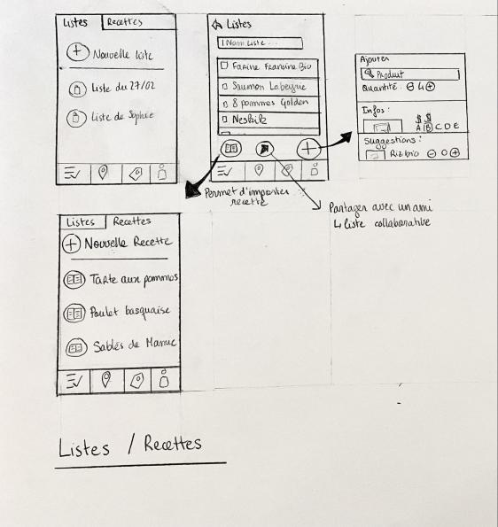

=== Interface utilisateur graphique

//Il peut y avoir une ou plusieurs interfaces utilisateur (UI en anglais),
ou interface graphique, ou interface homme machine (IHM) : une interface
sur ordinateur et/ou une interface sur mobile ou tablette (Android),
selon le nombre d’appareils en jeu.

//En lien avec un diagramme de séquence, une description simple de chaque
écran/page est nécessaire. Il est recommandé de faire des dessins, même
dessins au crayon photographiés ou scannés, car ce sont les meilleurs
supports de discussion : on appelle souvent ces dessins un
« storyboard ». Une description textuelle fait le lien entre tous les
éléments de l’IHM (ou des IHMs).

Notre projet est une application Android. Il est donc impératif de mettre en place une IHM pour smartphone et tablette, les dimensions étant différentes.

==== Storyboard

image::../images/story_board_premieres_pages.jpg[Premières pages de l'appli]

La première page où l'utilisateur peut intéragir est l'écran de connexion (en bas à gauche).

Cette page peut renvoyer sur une page de création de compte en cas de première connexion (avec les champs E-mail/Nom/Mot de passe/Confirmation de Mot de passe). Elle renvoie ensuite sur la page de connexion une fois les informations du compte validées.

La page de connexion demande simplement l'e-mail et le mot de passe, et possède un bouton "mot de passe oublié".

Une fois connecté, le client arrive sur la page d'acceuil (Milieu haut), dont le fonctionnement est détaillé ci dessous.

De cette page il peut accéder aux autres via les différents onglets.

La page offre (en haut à droite) la liste des différentes promotions dans les magasins où le client s'est déjà rendu et les affiche par catégories. 

Il s'agit ici de la page principale (haut gauche).

A part les onglets, elle présente les listes les plus récentes, et la possibilité d'en créer une nouvelle. 

La création de liste se fait en entrant un nom de produit (auquel cas il est ajouté) ou un type de produit (par exemple oeuf) : dans le second cas, un menu défilant propose les produits correspondant triés en fonction des préférences rentrées par l'utilisateur, de ses listes précédentes encore en mémoire et des promotions disponibles. Il est également possible d'ajouter directement une recette (sous-liste de type de produit, par exemple : chocolat, oeuf, beurre, farine ainsi que les quantités pour un gâteau au chocolat).

La création de recettes se fait exactement comme la création de listes, mis à part que l'on entre des types de produits et non des produits.

Une fois la liste terminée, elle est sauvegardée et affiche le coût du panier. 

Le bouton "partager" pour la liste envoie simplement sur une page avec un champ où l'on rentre le nom d'un utilisateur ou son identifiant. Une liste des amis (voir ci-dessous) est affichée en dessous du champ pour un envoi plus rapide.

Le partage de recette est exactement identique.

image::../images/story_board_profil.jpg[Le profil de l'utilisateur]

Il s'agit ici de la page de l'onglet profil. 

La page Préférence contient des case à cocher pour les préférences binaires (type Bio ou non, Végétarien...) et des curseurs pour les paramètres plus variables (type Budget mensuel).

La page Amis (ou Contacts) contient la liste des amis et permet d'effectuer des demandes d'amis et d'en accepter (voir storyboard).

La page Paramètres contient les divers paramètres ajustables et techniques de l'application (dont la liste exhaustive n'est pas encore établie).

Enfin, voici la page de l'onglet Plan, qui demande le magasin et la liste de course choisis, puis bascule sur la page du Plan.

Le plan affiche la position du client dans le magasin, et le tracé du chemin optimal à suivre pour récuperer ses courses. 

Le bouton "pause" fige la localisation. En mode pause, un bouton "code barre" apparait et ouvre l'appareil photo, permettant de scanner le code barre d'un produit afin de corriger son emplacement sur la carte pour l'ensemble des utilisateurs. Pour un utilisateur lambda, cette modification ne sera d'abord prise en compte que pour lui, puis, si le signalement est répété par d'autres utilisateurs, il le sera sur la base de donnée globale. Il existera différents utilisateurs "administrateurs" dont la modification sera directement prise en compte pour un seul ou plusieurs magasins.

==== Interface Web

L'Interface Web est en tout point la même que l'interface Android, mis à part qu'elle ne présente pas l'onglet plan.
