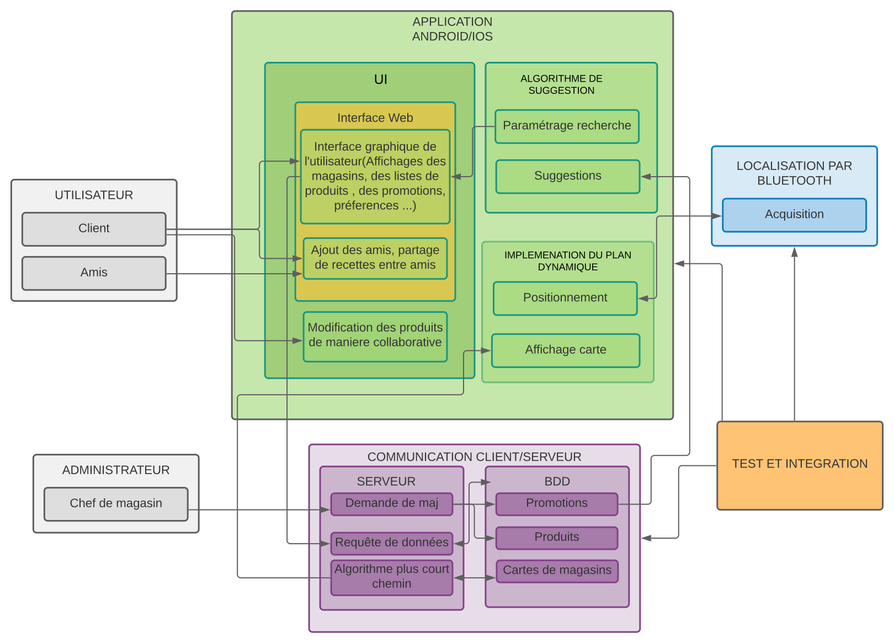

=== Schéma d’architecture

Insérer ici un ou plusieurs schémas d’architecture du projet. Voir le
cours d’introduction au Génie Logiciel. N’hésitez pas à faire des
schémas hiérarchiques, c’est à dire avec un bloc d’un schéma général
raffiné dans un second schéma ; ou des schémas en plusieurs parties.

==== Description des blocs

Il faut ici une description textuelle de chaque bloc, sa fonction
détaillée. En général, un bloc correspond à un module, sauf exception.
Il peut être adapté de faire des blocs plus petits qu’un module.

Il est important ici de distinguer les bibliothèques identifiées et
disponibles de ce que vous allez produire (coder) vous même. Vous ne
devez pas réinventer la roue mais vous ne devez pas non plus avoir votre
projet tout fait en encapsulant un programme déjà existant.

===== Localisation par Bluetooth 

Ce module consistera à acquerir la position de l'utilisateur en temps réel dans le magasin. Pour cela, on utilisera une méthode de triangulation à l'aide de balises bluetooth beacon. AndroidStudio nous fournit des bibliothèques permettant de gérer les fonctionnalités bluetooth. En particulier, elles permettent de pouvoir communiquer avec d'autres appareils bluetooth (envoyer et recevoir des données). Nous utiliserons donc cette bibliothèque pour implémenter l'algorithme de triangulation. 
Dans ce module, il s'agira aussi de déterminer l'emplacement des balises bluetooth afin de couvrir la plus grande surface à moindre frais. 

===== Base de donnée/Serveur

L'équipe chargée de ce module va dans un premier temps construire la base de donnée où l'on stockera les différents magasins, les produit(prix, impact environnemental, qualité nutritionnelle). L'équipe devra aussi gérer tout au long du projet le serveur et les requetes SQL. Elle devra fournir un système permettant aux magasins de mettre à jour les informations de leurs produits. De plus, il faudra mettre en place un service de mise à jour collaborative dans le cas où un produit déplacé n'aurait pas été notifié par le magasin. Les utilisateurs, en scannant le code barre pourront informer le reste de la communauté qui validera ou non ce changement. Ces changements se feront donc dans la base de donnée. 
Autre point essentiel: chaque utilisateur disposera d'un compte (Nom, prénom, email, mot de passe) associé à un identifiant unique. Des groupes (familles) pourront être créés afin de partager une même liste. Chaque changement effectué par l'un des membres devra donc s'accompagner d'un synchronisation pour toute la famille.
Le serveur ne devra pas effectuer trop de calculs afin d'éviter une surcharge. Il faudra donc s'assurer de la cohérence de l'implémentation des algorithmes sur les différentes interfaces (voir ci-après). 

===== Interface UI Android+Web

L'équipe chargée de ce module est au coeur du projet puisqu'elle developpera l'application Andoid par laquelle l'utilisateur se repérera dans le magasin après avoir rentré sa liste de course. L'équipe devra déveloper les différentes pages de l'application(écran de chargement, écran où l'on choisit le magasin, écran où l'on fait sa liste de produit, carte du magasin, promotions, ... ). Nous avons fourni un première aperçu de l'application ci dessus. On peut ainsi voir que de nombreuses fonctionnalités devront être prises en comtpe et reliées au reste du projet. L'interface ne s'arrête pas à l'application android.
Il faudra développer une interface Web qui permettrait de gérer uniquement les listes de courses. En effet, il est plus agréable de rentrer ses produits depuis son ordinateur que depuis un smartphone ou une tablette. Cet outil n'implémentera pas la fonctionnalité de guidage dans le magasin, qui ne peut se faire sur ordinateur.
*Remarque*: Nous avons décider de ne pas réaliser d'application pour iOS - du moins dans un premier temps - car cela nécessiterait d'apprendre un langage supplémentaire en parallèle de Java et surtout que la distribution sur iOS n'est pas libre.

===== Implémentation du plan dynamique

Le plan dynamique est la vue qui permettra à l'utilisateur de se repérer dans le magasin, le "gps" à proprement parler. Nous envisageons de réaliser celui-ci en deux et trois dimensions. Ainsi, l'utilisateur disposerait d'abord d'une vision globale en 2D de son parcours dans le magasin et pourrait basculer dans un mode 3D à la "StreetView" affichant plus précisemment l'emplacement des produits. Il pourrait être envisageable par la suite d'utiliser la réalité augmentée pour guider l'utilisateur, masi ceci n'est pour l'instant pas notre priorité.

===== Algorithmie

Ce module est le moteur (Engine) de notre application. C'est ici que nous développerons l'algorithme de plus court chemin permettant de guider l'utilisateur. Nous pourrons nous appuyer sur l'algorithme de Dijkstra en y apportant quelques modification car ici, il ne s'agit pas seulement d'aller du départ (l'accueuil du magasin) à l'arrivée (la caisse) le plus vite possible. Le graphe utilisé aura pour sommet l'ensemble des produits à acheter et il faudra donc passer par tous ces sommets. Une approche probabiliste ne semble pas nécessaire car le nombre de sommet devrait généralement être inférieur à 300.
Cet algorithme n'est pas le seul dans le projet. Nous devrons aussi développer un algorithme permettant de sélectionner des produits selon les préférences de l'utilisateur et les caractéristiques fournies par la base de donnée.

===== Test et Integration

Ce module consistera à tester les différents modules du projet afin de mettre en évidence certains problèmes. L'équipe se chargera aussi d'assembler les différents modules afin que le projet marche dans sa globalité. 

