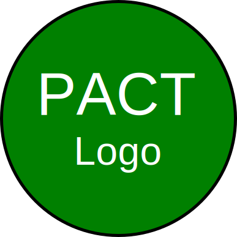

=== Description de la proposition
*_Note: 2 page max._*

_Décrire de façon détaillée votre projet : motivations de base/problèmes
constatés avant élaboration du projet, comment votre projet répond à ces
besoins. Ajouter une image ou une figure pour montrer à quoi cela
ressemble si besoin._

Pour répondre à la problématique du numérique au service de l'humain, nous avons dégagé plusieurs pistes de réflexion. D'abord, nous nous sommes penchés sur deux problématiques très générales et actuelles, qui nous tenaient à cœur : la préservation de l'environnement et la justice sociale. Nous avions à coeur de permettre aux citoyens d'adopter un mode de consommation plus responsable d’un point de vue environnemental et social. Ensuite, notre attention s'est portée sur des questions de santé publique, notamment à l'aune de la découverte de ce chiffre alarmant : d'ici 2030, le nombre de personnes en surpoids ou en obésité devrait doubler en Europe -portant même ce chiffre à 89% de la population Irlandaise ! Dès lors, nous souhaitions également aider ces mêmes citoyens a adopter un mode de consommation responsable d'un point de vue sanitaire. 
Enfin, nous avons réfléchi autour d'une dernière problématique plus originale : celle du temps et de son optimisation dans une société où les journées sont chargées. Parmi les tâches chronophages et répétitives dont il nous a paru opportun de réduire la pénibilité, nous avons identifier faire ses courses en grande surface. En effet, cela mobilise souvent un temps conséquent, la recherche des produits s'avérant longue sinon vaine lorsque le magasin ne possède pas le produit recherché. Ce problème concerne tout autant les magasins alimentaires que les magasins spécialisés. En particulier, la recherche est encore plus fastidieuse dans des magasins de bricolage (Leroy Merlin, Castorama...) : ils s'étendent sur d'immenses surfaces, le consommateur a rarement l'habitude d'y mettre les pieds et n'est pas forcément familier de l'agencement typique de ce genre d'enseignes. Notre voulions donc que notre projet, tout en répondant aux attentes susmentionnées, permettent aussi à chacun de gagner du temps. 

Nous comptons pour ce faire développer une application mobile. Nous la développerons pour les smartphones sous Android (plateforme privilégiée car représentant 80% des parts de marché des systèmes d'exploitation mobiles) et utiliserons donc le langage Java.

Concrètement, l'application permet la réalisation intelligente d’une liste de course. L'utilisateur choisit son enseigne parmi la liste des magasins partenaires. Il cherche les produits qu'il veut ajouter à sa liste, l'application lui suggérant les références de la base de données du magasin en fonction de critères environnementaux (impact carbone, quantité de plastique des emballages, engagement de la marque sur la préservation de l’environnement, produit issus de l'agriculture biologique…), sociaux (produits issus du commerce équitable, de producteurs locaux, rémunérant correctement les agriculteurs…), et sanitaires (indice calorique, présence d’additifs nocifs…). Elle met en exergue les produits dont la date de péremption approche ou légèrement détériorés (emballage abîmé, fruits et légumes du label "Gueules Cassées" ...) pour limiter le gaspillage. Elle prend évidemment en compte les préférences de l'utilisateur (quant au prix notamment, et aux critères précédemment cités), et les promotions du magasin. L'application fournit également des conseils et des rappels sur les pratiques permettant d'être responsable.

L’application permet en outre de réaliser un gain de temps. D’abord, les listes de courses peuvent être partagées entre utilisateurs, et enregistrées pour être réutilisées plus tard. Ensuite, elle permet la création ou l’importation depuis un site externe de recettes, les ingrédients génériques (« œufs »,  « chocolat »…) étant directement trouvés dans le magasin. Enfin, un système de balises Bluetooth (beacon) permettent de localiser précisément l’utilisateur dans le magasin, et permet de calculer le plus court chemin pour récupérer tous les produits de la liste de courses (le référencement des produits et leur localisation étant réalisée en amont mais pouvant être rectifiée de manière participative par les utilisateurs).

La réalisation de cette application soulève néanmoins deux problèmes. 

D'abord, celui de l'interêt commercial des magasins. En effet, il est légitime de se demander pourquoi les directions des enseignes accepteraient que nous développions ce projet dans leurs magasins dans la mesure où le temps qu'y passeraient leurs clients diminuerait. Or, il nous faut leur accord explicite puisque nous avons besoin de leurs bases de données, des emplacements de leurs produits, de leurs rayons...  Pour cela, nous comptons rappeler d'abord aux enseignes qu'elles s'y retrouveront dans la mesure où la possession d'un tel système est un atout marketing - les questions de justice climatique et sociales étant importantes pour une grande partie de la population - et attirera donc plus de clients. D'autre part, nous metterons en avant certaines promotions du magasin. 

Ensuite, le phénomène de fuite des consommateurs des petits commerçants vers les grandes surfaces pourrait se voir accentuer par notre application - son utilité restant modérée dans une petite surface où le gain de temps n'est pas significatif. Nous pensons néanmoins que l'application ne détournera pas les consommateurs utilisant ces magasins pour les achats de première nécessité, et nous leur offrirons tout de même la possibilité de partager leurs bases de données, et les consommateurs pourront alors choisir de s'y rendre si les produits souhaités s'y trouvent. Enfin, nous inciterons les consommateurs à ne pas les délaisser !

=== Exemples d'utilisation d'AsciiDoc

_Ici quelques exemples de syntaxe AsciiDoc pour ajouter des équations, des images, des listes..._

_Ces exemples *ne doivent pas* être conservé dans la version finale du rapport._

==== Exemples d'équations

* Inline math: latexmath:[\int_{-\infty}^\infty g(x) dx]
Pour ajouter une équation ou un symbole mathématique dans le corps du texte.

* Block math pour avoir une équation centrée au milieu de la page:

[latexmath]
++++
\int_{-\infty}^\infty g(x) dx
++++

==== Exemples d'images

* Ceci est un exemple d'image:

image::../images/logo_PACT.png[logo pact]

* L'image peut être redimensionnée et avoir un titre:

.Le logo du projet
image::https://media.discordapp.net/attachments/760468165817270286/763335790557396992/Architecture_PACT.png?width=862&height=468.png[logo pact, 400, 400]

* Pour le rapport, les images peuvent être aux formats jpeg, png ou même *svg*:

* Les images peuvent aussi être mises dans le corps du texte par exemple image:../images/logo_PACT.png[logo pact, 50,50].

==== Exemples de code

On peut ajouter des blocs de code formatés en précisant le langage utilisé:

[source,python]
----
def func(i):
   x = 3 + i
   return x

for i in range(10):
   print "---> ", func(i)
----

[source,java]
----
class foo {
   Integer i;
   String s;
}
----

==== Exemples de listes

* AAAA
** aaaaa
*** axaxax
** bbbbb
** ccccc
* BBBB
* CCCC

'''''

.  AAAA
..  aaaa
..  bbbb
.  BBBB
.  CCCC

'''''

.Liste des tâches à faire:
*  [ ] Pas encore fait
** [ ] étape X
** [x] étape Y (a démarré en avance)
** [ ] étape Z
*  [x] Complètement finit
** [x] étape Q
** [x] étape R
** [x] étape `finale` E=mc^2^

'''''

.Liste descriptive:

Étape 1::: Faire A, B, C…
Étape 2::: Faire X, Y, Z…
Étape 3::: Faire W, et c'est fini…

